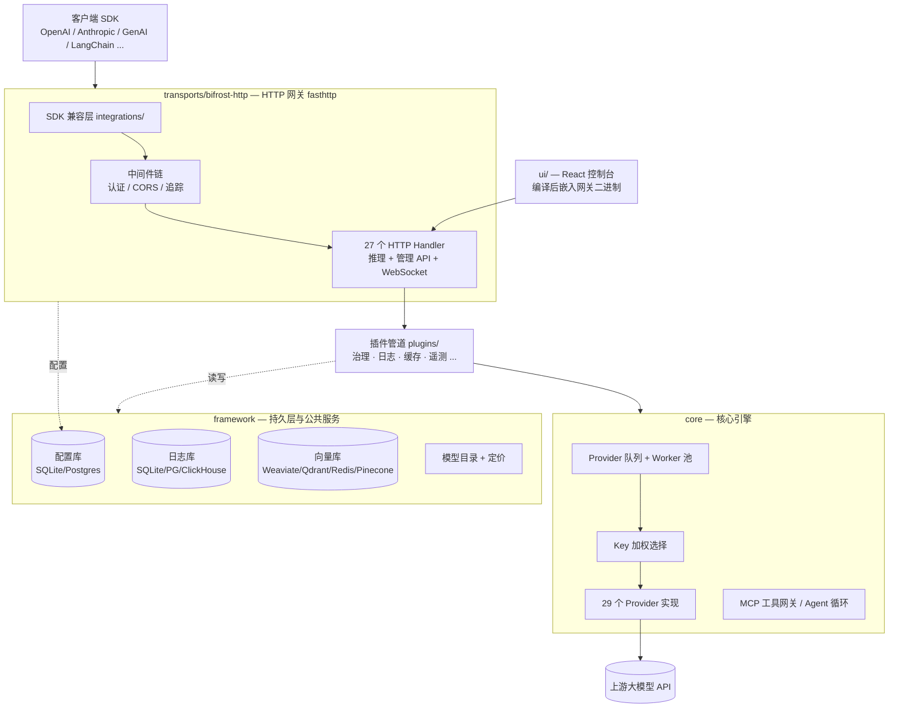

# Bifrost 中文说明文档

> 本文件夹是对 Bifrost 仓库（`maximhq/bifrost`）的完整中文导读，基于 `dev` 分支实际代码整理。
> 已提交在 fork（darkBaryon/bifrost）的 develop 分支上，随二次开发持续扩充。

## Bifrost 是什么

Bifrost 是 Maxim 出品的**高性能 AI 网关（LLM Gateway）**：把 20+ 家大模型供应商（OpenAI、Anthropic、AWS Bedrock、Google Vertex/Gemini、Mistral 等）统一到一个 **OpenAI 兼容的 API** 后面，并附带自动故障切换、负载均衡、语义缓存、治理（虚拟 Key/预算/限流）、MCP 工具网关等能力。

- 官方宣称性能：5000 RPS 下仅增加约 **11µs** 延迟（t3.xlarge）
- 默认端口：**8080**，Web 控制台与 API 同端口
- 一行启动：`npx -y @maximhq/bifrost` 或 `docker run -p 8080:8080 maximhq/bifrost`
- SDK 无缝替换：把 base URL 改成 `http://localhost:8080/openai`（或 `/anthropic`、`/genai`）即可

## 文档目录

| 文档 | 内容 |
|---|---|
| [01-总体架构.md](01-总体架构.md) | 仓库布局、模块依赖关系、一次请求的完整生命周期 |
| [02-core-核心引擎.md](02-core-核心引擎.md) | 核心 Go 库：请求调度、Provider 抽象、MCP、对象池 |
| [03-framework-框架层.md](03-framework-框架层.md) | 持久化与公共服务：配置库、日志库、向量库、模型目录、流式聚合 |
| [04-plugins-插件体系.md](04-plugins-插件体系.md) | 插件接口（Hook 机制）与 11 个内置插件详解 |
| [05-transports-HTTP网关.md](05-transports-HTTP网关.md) | HTTP 网关：路由、SDK 兼容层、配置加载、中间件 |
| [06-ui-管理控制台.md](06-ui-管理控制台.md) | Web 控制台：技术栈与全部功能页面 |
| [07-cli-工具链.md](07-cli-工具链.md) | 终端 TUI、npx 启动器、辅助命令行工具 |
| [08-部署与运维.md](08-部署与运维.md) | Docker、Helm、Terraform、一键部署配方 |
| [09-测试体系.md](09-测试体系.md) | 各层测试套件与运行方式 |
| [10-开发指南.md](10-开发指南.md) | 本地开发环境搭建（go.work！）、常用 make 命令、常见开发任务、IDE 报错排查 |
| [11-入口与依赖注入.md](11-入口与依赖注入.md) | 全部 main 入口清单、Bootstrap 装配时序、为什么不用 DI 框架、二次开发接线指南 |

## 5 分钟上手

```bash
# 方式一：npx（下载预编译二进制并运行）
npx -y @maximhq/bifrost

# 方式二：Docker
docker run -p 8080:8080 maximhq/bifrost

# 打开控制台
open http://localhost:8080
```

在控制台里添加 Provider 的 API Key 后，把现有应用的 base URL 指向 Bifrost 即可：

```python
# 原来: client = OpenAI(api_key=...)
client = OpenAI(base_url="http://localhost:8080/openai", api_key=...)
```

## 一图总览



各部分详细说明见对应章节。
