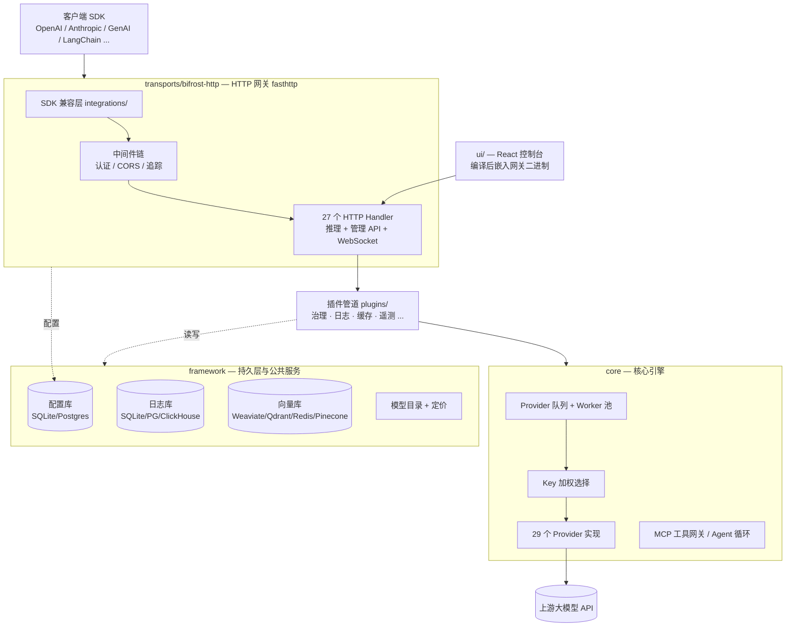

# Bifrost 中文说明文档

> 本文件夹是对 Bifrost 仓库（`maximhq/bifrost`）的完整中文导读，基于 `dev` 分支实际代码整理。
> 已提交在 fork（darkBaryon/bifrost）的 develop 分支上，随二次开发持续扩充。

## Bifrost 是什么

Bifrost 是 Maxim 出品的**高性能 AI 网关（LLM Gateway）**：把 20+ 家大模型供应商（OpenAI、Anthropic、AWS Bedrock、Google Vertex/Gemini、Mistral 等）统一到一个 **OpenAI 兼容的 API** 后面，并附带自动故障切换、负载均衡、语义缓存、治理（虚拟 Key/预算/限流）、MCP 工具网关等能力。

- 官方宣称性能：5000 RPS 下仅增加约 **11µs** 延迟（t3.xlarge）
- 默认端口：**8080**，Web 控制台与 API 同端口
- 一行启动：`npx -y @maximhq/bifrost` 或 `docker run -p 8080:8080 maximhq/bifrost`
- SDK 无缝替换：把 base URL 改成 `http://localhost:8080/openai`（或 `/anthropic`、`/genai`）即可

## 文档目录

按读者意图分区。**扩充规则**:通读过程中的进度和逐文件笔记记在 `07-阅读笔记`(按阅读顺序编号);读完一个主题后沉淀的结论性文章写进 `03-源码精读`(一个主题一篇);动手经验写进 `04-开发指南`(一个任务一篇)。

### 01-入门 —— 第一天读什么

| 文档 | 内容 |
|---|---|
| [阅读路线图](01-入门/01-阅读路线图.md) | 如何读懂 40 万行代码:跟请求生命周期走的主动脉读法 |

### 02-架构 —— 每模块是什么、为什么这样设计

| 文档 | 内容 |
|---|---|
| [总体架构](02-架构/01-总体架构.md) | 仓库布局、模块依赖关系、一次请求的完整生命周期 |
| [core 核心引擎](02-架构/02-core-核心引擎.md) | 请求调度、Provider 抽象、MCP、对象池 |
| [framework 框架层](02-架构/03-framework-框架层.md) | 配置库、日志库、向量库、模型目录、流式聚合 |
| [plugins 插件体系](02-架构/04-plugins-插件体系.md) | 插件接口(Hook 机制)与 11 个内置插件详解 |
| [transports HTTP网关](02-架构/05-transports-HTTP网关.md) | 路由、SDK 兼容层、配置加载、中间件 |
| [ui 管理控制台](02-架构/06-ui-管理控制台.md) | Web 控制台技术栈与全部功能页面 |
| [cli 工具链](02-架构/07-cli-工具链.md) | 终端 TUI、npx 启动器、辅助命令行工具 |

### 03-源码精读 —— 这段代码具体怎么运作(持续增长)

| 文档 | 内容 |
|---|---|
| [入口与启动装配](03-源码精读/01-入口与启动装配.md) | 8 个 main 入口清单、Bootstrap 装配时序(带行号) |
| [依赖注入模式](03-源码精读/02-依赖注入模式.md) | 手工组合根:为什么不用 wire/fx、三个 DI 要素 |

### 04-开发指南 —— 我想做 X 该怎么做

| 文档 | 内容 |
|---|---|
| [环境搭建与排错](04-开发指南/01-环境搭建与排错.md) | go.work、常用 make 命令、IDE 报错四连排查 |
| [开发工作流](04-开发指南/02-开发工作流.md) | fork 双水流模型:功能开发 + 上游同步 |
| [接线指南](04-开发指南/03-接线指南.md) | 加插件/Handler/Provider/后台服务在哪儿动手 |
| [测试体系](04-开发指南/04-测试体系.md) | 各层测试套件与运行方式 |
| [UI中文化层](04-开发指南/05-UI中文化层.md) | DOM 字典翻译方案:零源码侵入、最小 merge 税 |
| [开发工作台](04-开发指南/06-Playbook落地规则.md) | Workbench 模式:frontmatter 状态机/预飞/评审/Gate/本地站点 |

### 05-部署运维

| 文档 | 内容 |
|---|---|
| [部署方式](05-部署运维/01-部署方式.md) | Docker、Helm、Terraform、一键部署配方 |

### 07-阅读笔记 —— 通读进度与逐文件笔记

| 文档 | 内容 |
|---|---|
| [进度总览](07-阅读笔记/README.md) | 主线阅读路线打卡 + 笔记索引 |
| [transports-main入口](07-阅读笔记/01-transports-main入口.md) | main.go 细读:embed UI、init/flag、profiling、logger 注入 |
| [server-BifrostHTTPServer](07-阅读笔记/02-server-BifrostHTTPServer.md) | server.go:三个职责、回调接口与企业版插座、热更新、存储布局、成长史 |

### 06-产品调研 —— 市场与竞品

| 文档 | 内容 |
|---|---|
| [竞品全景](06-产品调研/01-竞品全景.md) | AI 网关市场五象限地图、2026 整合大事记、Bifrost 竞争坐标 |
| [象限A功能对比](06-产品调研/02-象限A功能对比.md) | 七大开源网关功能矩阵、五个战略判断、中国合规缝隙假设修正 |

## 5 分钟上手

```bash
# 方式一：npx（下载预编译二进制并运行）
npx -y @maximhq/bifrost

# 方式二：Docker
docker run -p 8080:8080 maximhq/bifrost

# 打开控制台
open http://localhost:8080
```

在控制台里添加 Provider 的 API Key 后，把现有应用的 base URL 指向 Bifrost 即可：

```python
# 原来: client = OpenAI(api_key=...)
client = OpenAI(base_url="http://localhost:8080/openai", api_key=...)
```

## 一图总览



各部分详细说明见对应章节。
