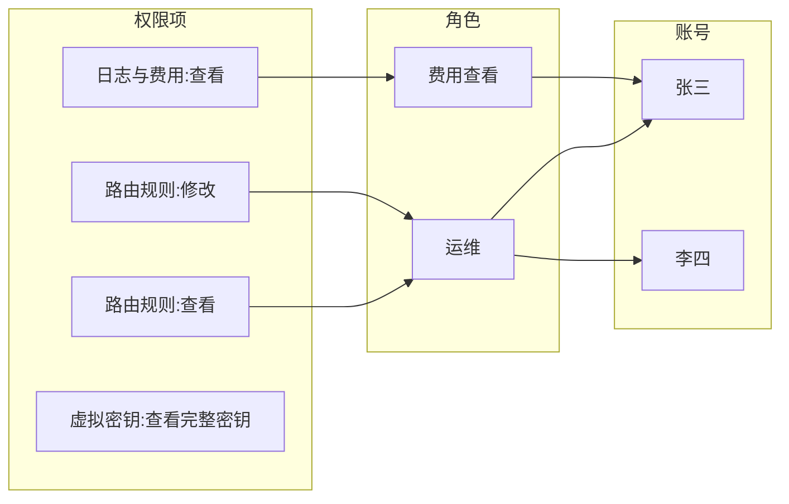

# 角色与权限

> **已确认**(2026-09-09):本轮先实现后端,前端后续接入;一个账号可分配多个角色,有效权限为各角色权限的并集;原共享管理员账号升级为首个主管理员,用户名密码保留,升级后需重新登录;尚未配置管理员的实例先完成初始化。
>
> **已决定**:按用户、按项目的资源治理(预算、记账、用量归属)不属于本需求,另立需求,调研见[资源治理](../资源治理/企业版资源治理调研.md)。
>
> 2026-09-09 用户确认本文作为角色权限的产品需求文档;第六节七项决策同日逐条确认。竞品依据见[竞品产品调研](竞品产品调研.md)与[竞品源码研究](竞品源码研究.md)。本文只描述产品行为与规则,不涉及实现。

## 一、背景与目标

控制台目前只有一组共享的管理员凭据,所有使用者拥有完全相同的权限,无法区分操作人,也无法限制某些人只能查看。

目标:管理员可以创建角色并为角色配置权限,再将角色分配给账号。权限随角色变化,不需要逐个账号维护。

## 二、概念模型

- **权限项**:系统预定义的操作集合,例如"查看路由规则""修改虚拟密钥"。用户不能自定义权限项。
- **角色**:一组权限项的集合,由管理员创建并命名,对应一个岗位。
- **账号**:登录控制台的用户。一个账号可分配多个角色,有效权限为这些角色权限项的并集。

图中:"运维"角色包含路由规则的查看和修改;"费用查看"角色包含日志与费用的查看。张三同时拥有两个角色,可以修改路由并查看费用;李四只有"运维",不能查看费用。"查看完整密钥"未分配给任何角色,因此任何账号都不能执行。未被任何角色授予的操作默认拒绝。

## 三、功能范围

页面位置、权限项命名、预置角色名称对齐 Bifrost 企业版:角色管理位于"治理"菜单下的"角色与权限",账号管理位于"用户"页。

### 3.1 角色管理

- 角色列表:名称、说明、关联账号数、是否为系统预置。
- 创建与编辑:填写名称和说明;从权限项清单中勾选,清单按功能模块分组展示。
- 删除:若仍有账号关联该角色,提示关联账号数并拒绝删除,需先调整这些账号的角色。
- 系统预置角色:主管理员的权限不可修改;其余预置角色可修改权限,但不可删除。

### 3.2 账号管理

- 账号列表:登录名、显示名、已分配角色、状态(启用/停用)、最近登录时间。
- 创建:登录名、显示名、初始密码、角色(可多选)。
- 详情:已分配的角色;有效权限列表,并标注每个权限项来源于哪个角色。
- 操作:修改角色、停用/启用、重置密码、删除。账号不能修改自己的角色,也不能停用自己。

### 3.3 个人中心

查看本人的角色与有效权限;修改本人密码。

### 3.4 界面表现

无权限的菜单项与操作按钮不显示。直接访问无权限的页面时显示"没有权限"提示,不得出现空白页或报错。

## 四、权限项清单

权限项按控制台功能模块划分,每个模块提供三类操作:

- **查看**:浏览列表与详情。
- **管理**:新增、修改、删除。
- **敏感操作**:单独设为权限项,拥有"查看"或"管理"权限不自动获得。划入敏感操作的标准是:泄露后不可撤回,或权力超出所在模块。

以"日志与费用"模块为例:查看包括报表、统计和日志列表;管理包括清理日志、重算费用;敏感操作包括查看请求与响应原文、导出数据。

删除厂商、清理全部日志、轮换虚拟密钥等操作虽有破坏性,但影响限于本模块、过程可见、可以补救,归入"管理",不扩大敏感操作清单。敏感操作共七项,单独授权的理由如下:

| 敏感操作 | 单独授权的理由 |
|---|---|
| 查看厂商密钥完整值 | 获得真实厂商 API key 后可绕过网关直接调用,泄露后只能到厂商侧作废 |
| 查看虚拟密钥完整值 | 可冒用任意团队身份调用,消耗该团队预算 |
| 查看请求与响应原文 | 涉及业务数据与个人信息 |
| 导出数据 | 上一项的批量形式 |
| 修改登录认证设置 | 可修改管理员密码或关闭认证,等同接管控制台 |
| 导入配置 | 一次性覆盖全部配置(含密钥与认证设置),绕过其他所有权限项 |
| 加载在服务端执行代码的插件 | 等同在网关服务器上执行任意代码 |

后两项权力超出所属模块,因此从"系统设置管理""插件管理"中单列;否则预置角色"开发者"无法安全地包含这两个模块的管理权限。

首版清单如下。实施前需按当时的控制台功能核对,本表为产品口径,不是接口清单。

| 功能模块 | 查看 | 管理 | 敏感操作 |
|---|---|---|---|
| 模型与厂商 | 厂商、模型、密钥列表 | 厂商、模型、密钥的增删改 | 查看密钥完整值 |
| 虚拟密钥 | 列表与详情 | 增删改、轮换 | 查看虚拟密钥完整值 |
| 团队、客户、预算、限流 | 列表与详情 | 增删改 | 无 |
| 路由规则 | 列表 | 增删改 | 无 |
| 日志与费用 | 报表、统计、日志列表 | 清理日志、重算费用 | 查看请求响应原文、导出 |
| MCP 工具 | 列表 | 增删改、连接授权 | 无 |
| 插件 | 列表 | 增删改 | 加载在服务端执行代码的插件 |
| 提示词库、技能库 | 列表 | 增删改 | 无 |
| 系统设置 | 查看配置 | 修改常规配置、代理、功能开关、缓存 | 修改登录认证设置、导入配置 |
| 通知与 Webhook | 列表 | 增删改 | 无 |
| 账号与角色 | 查看账号与角色 | 角色增删改、角色分配、账号管理 | 无 |

系统预置三个角色,命名与 Bifrost 企业版一致:

- **主管理员**:全部权限;不可删除,权限不可修改。
- **开发者**:除"账号与角色"模块和全部敏感操作以外的查看与管理权限。
- **只读**:全部模块的查看权限,不含敏感操作。

## 五、业务规则

以下规则已于 2026-09-09 全部确认。

**角色**

- 角色可自由创建、重命名、删除,不限于预置角色。
- 角色的权限只能从权限项清单中选择。
- 删除仍有账号关联的角色时拒绝删除并提示关联账号数,管理员先调整相关账号的角色再删除。删除对话框内批量改派作为后续增强,本轮不做。

**账号**

- 一个账号可有多个角色,有效权限为并集;未授予的操作一律拒绝。
- 角色权限或账号的角色分配变更后,该账号的下一次操作即按新权限执行,无需重新登录。
- 账号停用后,其已登录的会话在下一次操作时失效。
- 账号管理范围限于:管理员创建账号、设置初始密码、停用/启用、重置密码;用户修改本人密码。不包含邀请、入职离职等流程。
- 本轮角色的作用范围为整个网关,不提供"仅管理某个团队"的范围限制;该能力归入资源治理需求。

**安全**

- 前端隐藏无权限的入口,后端对每个操作做同样的权限校验;绕过页面直接调用接口同样被拒绝。
- 创建角色、修改角色权限、分配角色本身也是权限项,默认仅主管理员拥有。任何账号不能修改自己的角色。
- 系统至少保留一个可用的主管理员:不能停用或删除最后一个主管理员,也不能移除其主管理员角色。
- 查看完整密钥、查看请求原文、导出数据、修改登录认证设置等敏感操作需单独授权,"只读"角色不包含这些权限。

## 六、决策记录

以下七项于 2026-09-09 由用户逐条确认,正文已按结论更新:

1. 参照对象:界面位置、权限项命名、预置角色名称对齐 Bifrost 企业版。
2. 权限粒度:每个模块三类操作(查看、管理、敏感操作),不采用增删改查四类。
3. 预置角色:主管理员、开发者、只读三个,默认权限见第四节。
4. 主管理员保护:权限不可修改、至少保留一个、仅主管理员默认拥有角色管理权限。
5. 敏感操作:第四节所列七项;"导入配置""加载服务端执行代码的插件"从所属模块的管理权限中单列。
6. 角色删除:有账号关联时拒绝删除并提示关联数;对话框内批量改派留作后续增强。
7. 个人中心:本轮提供,含用户自助修改密码。

待补充调研(不阻塞进入开发):Bifrost 企业版本地账号分配角色的界面;其完整权限项清单,用于对齐第四节命名;权限变更后的生效时点。

## 七、验收标准

1. 创建"运维"角色,仅包含路由规则的查看与管理。张三、李四分配该角色后,均可修改路由,均不能修改预算,且看不到预算菜单。
2. 从"运维"移除"管理路由"。两人无需重新登录,下一次修改路由被拒绝,页面上编辑按钮消失。
3. 为张三追加"费用查看"角色。张三可查看费用,李四不可;张三仍不能修改预算;张三的账号详情标注"费用查看"权限来源于哪个角色。
4. 李四绕过页面直接调用角色修改接口为自己增加权限。请求被拒绝;李四也不能修改自己的角色列表。
5. 停用张三后,其已打开的页面在下一次操作时失效。
6. 删除最后一个主管理员或移除其主管理员角色,操作被拒绝并提示原因。

## 八、实现阶段注意事项

以下来自竞品源码研究,属于开发方案需要回答的问题,不是产品规则:

- 权限变更如何做到"下一次操作即生效";多实例部署时的同步时限。
- 同一个编辑接口可能同时包含常规操作与敏感操作,后端需在接口内部再次校验敏感部分。
- 预置角色的默认权限不能在每次启动时重写,否则用户对"开发者"角色的修改会丢失。
- 权限项清单必须覆盖全部管理功能,不能只接入部分模块。
- 控制台账号的权限与调用方虚拟密钥的权限是两套体系,分开存储。

本地核对入口:[登录处理](../../../transports/bifrost-http/handlers/session.go)、[会话记录](../../../framework/configstore/tables/sessions.go)、[前端权限占位](../../../ui/app/_fallbacks/enterprise/lib/contexts/rbacContext.tsx)。核对基线:`9a2e707c6`。
