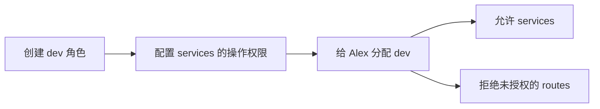

# 自定义角色：开源与商业产品实际怎么做

> 调研日期：2026-09-09。只描述竞品，不制定 Bifrost 二开方案。商业功能依据官方文档及其中的操作说明，未登录商业实例实测；公开代码的证据见[竞品源码研究](竞品源码研究.md)。

## 结论

“创建一个角色，为它配置权限，再分配给账号”已经有成熟产品支持。Bifrost 企业版、TrueFoundry 和 Kong Gateway 企业版均有明确文档证据。此前仅从三个公开代码仓库得出的判断，不足以代表完整产品能力。

| 产品与范围 | 新建自定义角色 | 给角色配置权限 | 分配给用户 | 本次证据 |
|---|---|---|---|---|
| Bifrost Enterprise | 明确支持 | 资源与操作组合 | 明确支持身份提供方角色映射；本地用户手动分配的完整界面尚未核实 | RBAC 配置步骤、API 示例、身份接入文档 |
| TrueFoundry 平台（含 AI Gateway 权限） | 明确支持 | 从平台权限清单选择 | 用户编辑页选择；也可分配给团队 | 创建、编辑、分配的完整操作说明 |
| Kong Gateway Enterprise | 明确支持 | 端点／实体、操作、Workspace 范围 | 可分配一个或多个角色 | 官方教程、Admin API 和 Kong Manager 说明 |
| Portkey Enterprise | 未找到足够明确的新建角色流程 | 明确支持调整工作区角色的资源访问 | 明确支持组织及工作区角色分配 | 官方角色与访问控制文档 |
| LiteLLM（公开实现及企业角色文档） | 未确认任意命名自定义角色的完整功能 | 已确认预设角色、团队成员操作权限配置 | 支持预设全局与组织／团队角色 | 官方角色文档与已下载代码 |
| New API 已下载源码 | 未找到完整新建角色流程 | 当前为固定角色默认权限加逐账号覆盖 | 根据用户系统角色映射 | 固定 commit 源码 |

“未确认”不等于“不支持”；“支持修改现有角色权限”也不能自动当作“支持新建任意角色”。商业产品能力与其公开网关代码覆盖范围分别判断。

## Bifrost 企业版：独立创建角色，再配置资源权限

官方入口为 `Governance → Roles & Permissions`。点击 `Add Role`，填写名称和描述，创建后通过 `Manage Permissions` 配置权限。

权限面板左侧选择资源，右侧切换查看、创建、更新、删除等操作，保存到角色。系统预设 Admin、Developer、Viewer；文档说明系统角色不能删除，但权限可以调整。这里描述的是该文档版本，不能将其列出的权限数量当作永久规格。

来源：[Bifrost RBAC 官方说明](https://docs.getbifrost.ai/enterprise/rbac)。

账号侧明确记录了另一条链：把身份提供方的组或属性映射到 Bifrost 内置或自定义角色，用户登录和同步时应用映射。多个角色匹配时，文档描述为最高权限优先，不能改写成“所有角色权限自动取并集”；自定义角色之间具体如何比较高低，本次未核实。

来源：[Bifrost 身份接入与角色映射](https://docs.getbifrost.ai/enterprise/user-provisioning)。

**证据边界：**角色创建和权限编辑已有具体步骤。纯本地账号的手动分配界面、已分配角色的删除处理、权限编辑对现有会话的确切生效时点，尚未得到足够证据，不补写假定流程。

## TrueFoundry：创建角色后，在用户页面选择它

官方步骤最直接：进入 `Access → Roles → Custom Roles`，创建角色，填写标识、显示名称、说明和权限；随后进入 `Access → Users`，编辑用户并选择该角色。也能在团队编辑页分配角色，由成员继承。

每个用户直接分配一个租户级角色，来自团队的角色权限与直接角色合并。租户级权限覆盖租户内相应类型的资源；对某一个具体模型或工作区的协作权限，则通过该资源的 Collaborators 单独授予。Admin 权限不可编辑。两类授权不能混为同一种角色配置。

来源：[TrueFoundry 角色管理与完整操作步骤](https://www.truefoundry.com/docs/platform/manage-user-roles-and-permissions)。

版本佐证：官方更新记录在 2026-01-12 的 v0.111.2 中明确列出自定义租户角色与用户分配；后续记录又增加其他身份与默认角色管理能力。因此这不是仅有概念说明的未发布设想。[官方更新记录](https://www.truefoundry.com/docs/changelog)

**证据边界：**这是平台级 IAM，包含 AI Gateway 相关权限，不应理解为免费独立网关具备整个控制台。具体购买套餐、删除仍被使用的角色时如何处理、现有会话权限刷新时限，本次未确认。

## Kong Gateway 企业版：自定义角色绑定端点权限，再分配给账号

官方教程给出完整实例：创建用户 Alex，创建 `dev` 角色，允许该角色操作 `/services/`，然后将角色分配给 Alex；教程再验证访问 `/routes` 被拒绝。教程明确要求 Enterprise，且不是 Kong Konnect 的授权系统。

来源：[Kong 创建角色、授权、分配及验证教程](https://developer.konghq.com/how-to/configure-rbac-user-in-kong-gateway/)。

Kong 的权限比简单勾选功能更细，包含端点、操作和 Workspace。用户可关联多个角色；判权按具体规则优先于通配规则处理，而不是无条件合并成允许。普通 admin 默认不具备管理 RBAC 的能力，super-admin 才具备相应授权。[当前 RBAC 规则](https://developer.konghq.com/gateway/entities/rbac/)

控制台个人账号与只访问管理 API 的 RBAC 用户有所区别。Kong Manager 邀请管理员时可以选择角色，因此角色分配不仅存在于 API 示例中。[管理员界面流程](https://developer.konghq.com/gateway/entities/admin/)

**证据边界：**已确认产品功能和操作步骤，未启动企业服务。复杂 Workspace 继承、否定规则和角色删除影响需要按采用版本另行验证，不能从示例推断全部行为。

## Portkey：可以调整角色权限，但任意新建角色仍需核实

官方明确区分组织 Owner／Admin／Member 与工作区 Admin／Manager／Member；组织管理员可调整工作区角色对日志、分析、Provider 和 API Key 的访问。用户先加入组织，再被分配工作区角色。[角色说明](https://portkey.ai/docs/product/enterprise-offering/org-management/user-roles-and-permissions)

另一篇企业访问控制文档宣称角色可定制，但展示的主要是预设角色和权限表，没有给出与前面三家同等明确的“新建角色”步骤。因此目前确认的是角色权限可配置，不把宣传表述直接扩展成任意岗位角色创建。[企业访问控制](https://portkey.ai/docs/product/enterprise-offering/access-control-management)

两页对 Member 可操作范围的呈现也不同，且有组织、工作区层级区别；不能拼成一份无版本、无层级的权限矩阵。API Key 的权限开关同样不作为员工自定义角色的证据。

## LiteLLM 与 New API：保留已核实的事实，不推断商业版缺失

LiteLLM 官方列出全局预设角色，以及企业版组织和团队管理员；还可配置团队成员允许执行的 Key 操作。此次补查仍未找到任意新建岗位角色的完整官方流程，因此商业版这一项保持“未确认”。[官方访问控制](https://docs.litellm.ai/docs/proxy/access_control)

New API 的当前代码事实仍是内置 root／admin 映射与账号权限覆盖；并不能证明未来版本或未公开商业服务一定没有自定义角色。详见[源码研究及固定提交链接](竞品源码研究.md)。

## 这次调研纠正了什么

1. 有成熟产品支持“角色 → 权限 → 用户”，不必先接受此前由我们提出的规则。
2. 产品行为调研必须覆盖商业版，开源代码用于进一步核实实现，不用于限定调研对象。
3. 各家的角色数量、作用范围、合并规则和系统角色保护并不一致。选定参考产品之前，不把这些细节拼成我们自己的机制。
4. 当前只完成调研与总结，尚未选定产品蓝本，也未确定二开方案。

商业文档没有提供版本号的部分按访问日期记录，官方页面后续可能变化。本次没有购买试用、创建外部账号、修改远程资源或运行付费产品；不能把文档描述标为商业实例实测。
