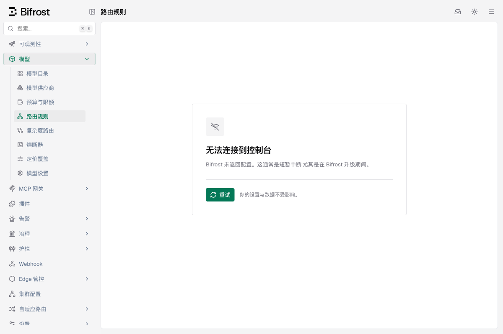
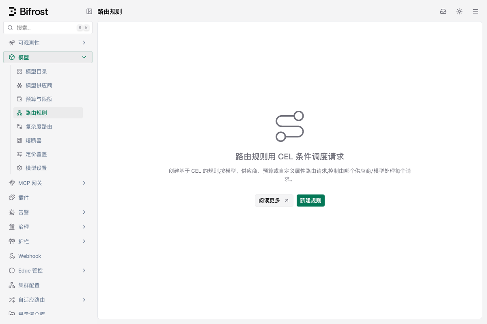

# 控制台登录与权限接入：期1外层配置真实权限验证

2026-09-23。用户要求实测「只有路由查看权限是否会被工作台外层配置读取挡住」。本记录是**现状诊断**，不代表登录/权限前端功能已经实施或正式验收通过。

## 结论

在基线 `d93fa8ad2082c716f76c55720b2272e718a7f649` 的原完整 EE 前端与真实 EE 后端上，复现了该阻断。

| 同一临时账号的后端权限 | `/api/config` | `/api/routing/rules` | 浏览器页面 |
|---|---|---|---|
| 仅 `RoutingRules.View` | 403 | 200 | 正文显示「无法连接到控制台」；`config-unreachable`存在 |
| 再增加 `Settings.View` | 200 | 200 | 路由规则空列表页面正常显示；`config-unreachable`不存在 |

管理员HTTP对照中，两接口也都是200。两次浏览器使用同一个用户、同一角色、同一二进制、同一数据库和同一路径；只新增一个权限并重新登录，分别使用全新浏览器上下文避免配置缓存。未修改前端组件/hook，未mock接口。

这证明路由列表读取权限本身已经满足，公共外层对完整config的依赖额外挡住正文。对照中授予Settings.View仅用于验证因果，不是正式修复方案；后续候选仍是分离工作台基础状态与完整系统配置。

## 页面证据

仅有路由查看权限：

同账号再增加设置查看权限：

## 如何构造

1. 从该工作树HEAD用 `git archive` 导出 ui/ee/core/framework/plugins/transports 到新临时目录；3316个受检已跟踪文件与基线工作树逐文件SHA256比较，无差异。
2. 在副本执行原 `ee/ui/sync.sh`，复用本机已安装的UI依赖，运行原 `vite build --configLoader runner`。原完整入口、路由、ClientLayout、EE覆盖与fallback全部保留；产物复制到副本EE embed目录。
3. 使用 `GOWORK=off GOMAXPROCS=2 go build -mod=readonly -p 2 -buildvcs=false` 构建该副本EE二进制；产物SHA与源码基线存入 provenance.json。
4. 复用 `identity-smoke.py` 的 Node进程/HTTP夹具，创建隔离SQLite、随机本机端口（本轮63602），providers为空；初始化临时管理员，并通过真实角色和账号API创建仅有RoutingRules.View的角色/用户。
5. 管理员与测试用户均完成改密，再核对身份不是受限会话；浏览器加载服务端真实签发的HttpOnly会话，直接打开完整 `/workspace/routing-rules`。这是为了隔离config问题，不是验证尚未开发的登录表单。
6. 保存只读组页面快照/截图，再在浏览器会话中主动fetch两个接口及permissions/me，确认权限集合与响应状态。随后只给原角色增加Settings.View，同用户重新登录，在新浏览器上下文中重复观察。

启动账号/角色与改密均为实际后端操作；没有使用真实账号、原有数据库或用户正在浏览的59817实例。

## 原始记录与限制

公开记录位于[证据目录](控制台登录与权限接入-期1-外层配置验证/provenance.json)：

- `provenance.json`、`source-integrity.json`：基线、构建命令、二进制SHA与源码一致性。
- `summary.json`、`comparison.json`：HTTP对照结果、已完成改密及同账号仅增加Settings.View；只含非敏感摘要。
- `baseline-observation.txt`、`comparison-observation.txt`：浏览器中的权限集合、主动fetch状态和正文内容。
- `baseline-snapshot.txt`、`comparison-snapshot.txt`及两张截图：原页面的实际渲染。
- `fixture.py`：本轮使用的临时真实认证夹具，接受新临时目录/源码/二进制；启动后显式执行 `grant-settings` 才增加对照权限。

**界限：**

- 观察记录中的两个接口状态来自页面加载后执行的主动fetch探针；不能声称被挡住时页面自身已经自动查询了路由列表。
- 本次验证空列表及外层阻断；没有测试非空列表、规则编辑提交、真实登录表单、多标签同步或新改密建议行为。
- 当前前端仍使用原全允许RBAC fallback。因此对照截图中的新建按钮可见不表示该只读账号有后端写权限，也不表示前端权限已经接好。本次未点击或提交写操作。
- 管理员只有HTTP对照，没有管理员浏览器验收。
- 附属接口/通知仍可能403；本次结论仅针对config导致的正文阻断，不将全部403等同整页故障。

本次临时EE进程和诊断浏览器已关闭，会话及含凭据的状态文件未复制进仓库。仓库业务源码没有改动。
